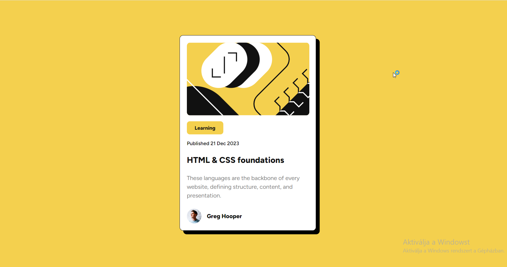

# Frontend Mentor - News homepage solution

This is a solution to the [News homepage challenge on Frontend Mentor](https://www.frontendmentor.io/challenges/news-homepage-H6SWTa1MFl). Frontend Mentor challenges help you improve your coding skills by building realistic projects. 

## Table of contents

- [Overview](#overview)
  - [The challenge](#the-challenge)
  - [Screenshot](#screenshot)
- [My process](#my-process)
  - [Built with](#built-with)
  - [Continued development](#continued-development)
- [Author](#author)

**Note: Delete this note and update the table of contents based on what sections you keep.**

## Overview

### The challenge

Users should be able to:

- View the optimal layout for the interface depending on their device's screen size
- See hover and focus states for all interactive elements on the page

### Screenshot

### Links

- Solution URL: [Add solution URL here] (https://github.com/Blanchevalen/Blog_preview_card/)
- Live Site URL: [Add live site URL here](https://blanchevalen.github.io/Blog_preview_card/)

## My process

### Built with

- Semantic HTML5 markup
- CSS custom properties
- Flexbox
- CSS Grid
- Mobile-first workflow

### Continued development

**I started learn Angular a few month ago and I build a project, but I want to solve the career path challenge also.**

## Author

- Frontend Mentor - [@blanchevalen](https://www.frontendmentor.io/profile/blanchevalen)

**Note: Delete this note and add/remove/edit lines above based on what links you'd like to share.**

